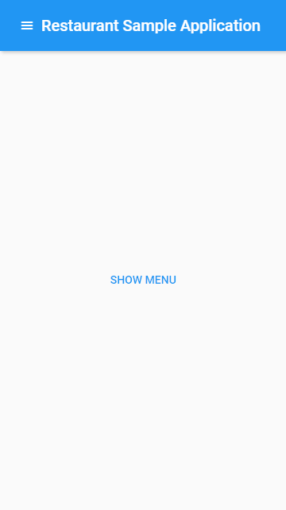

# Devon4Sencha migration to ExtJS 6.5

## Pagination plugin

ExtJS 6.5 already provides pagination on *modern* toolkit.
However, the way to use pagination differs from *classic* to *modern*, e.g.:
    
* classic: use a `pagingtoolbar` component as the bottombar

```javascript
Ext.create('Ext.grid.Panel', {
    title: 'Simpsons',

    store: store,

    columns: [...],

    bbar: {
        xtype: 'pagingtoolbar',
        displayInfo: true
    }
});
```

* modern: do not instantiate the component directly, but use the 
`pagingtoolbar` plugin in the grid

```javascript
Ext.create('Ext.grid.Grid', {
    title: 'DC Personnel',

    store: store,

    columns: [...],

    plugins: [{
        type: 'pagingtoolbar'
    }]
});
```

Currently, devon4sencha provides a plugin named "Pagination" for both *classic* and *modern* grids. 
This can be useful to unify and simplify the use of pagination for both toolkits, but it prevents 
us from setting additional/custom configurations (e.g. `displayInfo: 'true'`). 

So, although we can keep the "Pagination" plugin implementation, I would recommend to use the 
Sencha *official* way for each toolkit (see above examples).

## Menus 
In ExtJS 6.5 *Modern* toolkit the class `Ext.Menu` has been removed. Use the `Ext.menu.*` family 
classes instead, like in *Classic*. 
See [reference](http://docs.sencha.com/extjs/6.5.0/guides/whats_new/whats_new.html#whats_new-_-whats_new_-_menus).

Moreover, if you want to implement an *Android-like* menu that animates in and out from the side
of the screen when shown, you need to use an `Ext.ActionSheet` instead of a regular menu. See [example](http://docs.sencha.com/extjs/6.5.0/modern/Ext.ActionSheet.html).

